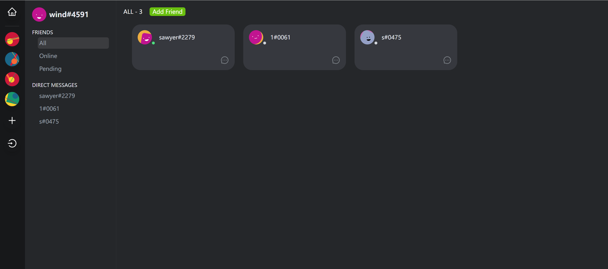
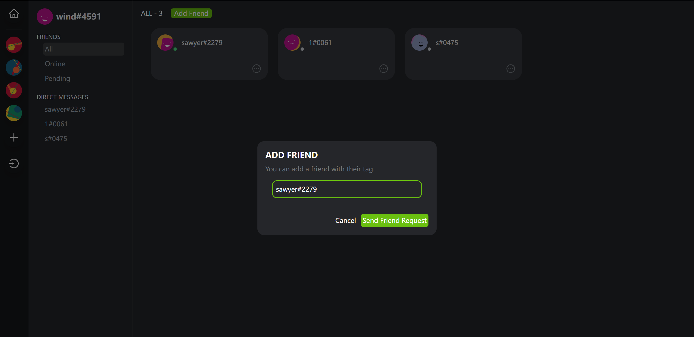
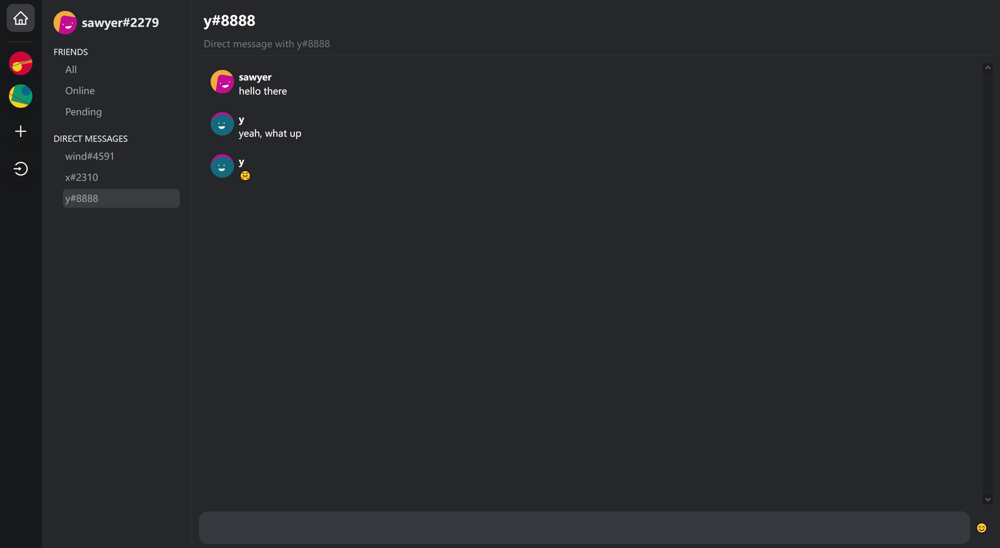
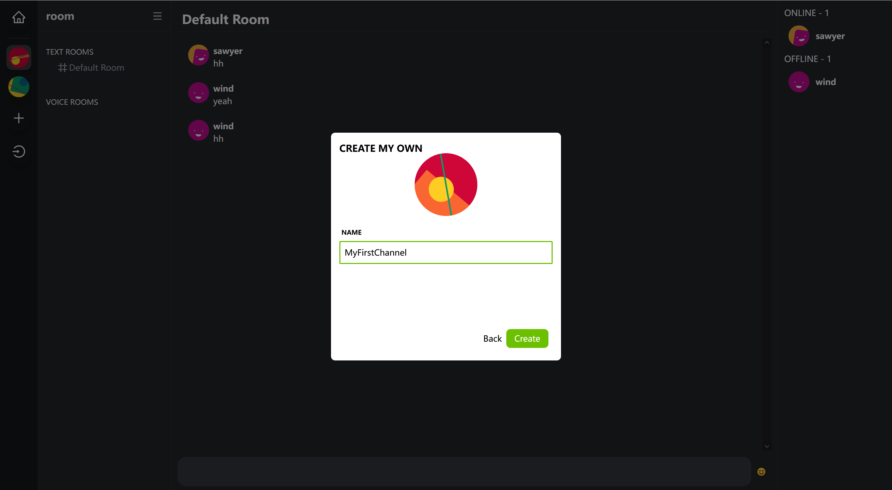
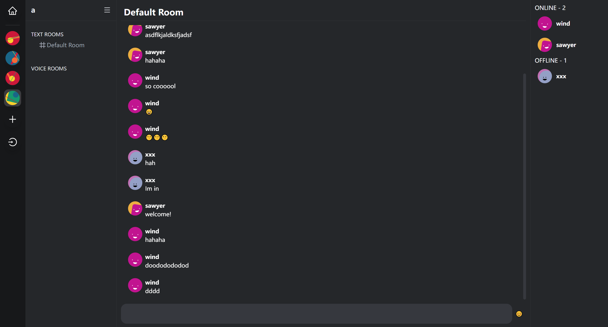

An IM (as Instant Messaging) made by Sawyer.

## Demo










## Getting Started

First, run the development command:

```bash
docker compose up --build
```

Open [http://localhost:3000](http://localhost:3000) with your browser to see the result.

Signup [http://localhost:3000/entry/signup](http://localhost:3000/entry/signup)

Login [http://localhost:3000/entry/login](http://localhost:3000/entry/login)

Private Msg Sending  [http://localhost:3000/home/](http://localhost:3000/home/)

## Test Accounts

account1: email: 1@gmail.com password: 1

account2: email: 2@gmail.com password: 1

...

## DB Schema

You can find db schema in ./packages/server/prisma/schema.prisma

Currently using sqlite for dev enviroment.

## Features

### Delivery Guarantees

1. Message ordering
2. At least once message arrival
3. Client side message caching

## License

This is a [No License](https://choosealicense.com/no-permission/) project which means you can view and fork the sourcecode arbitrarily, but you can't modify, share or distribute the software for any purpose.
